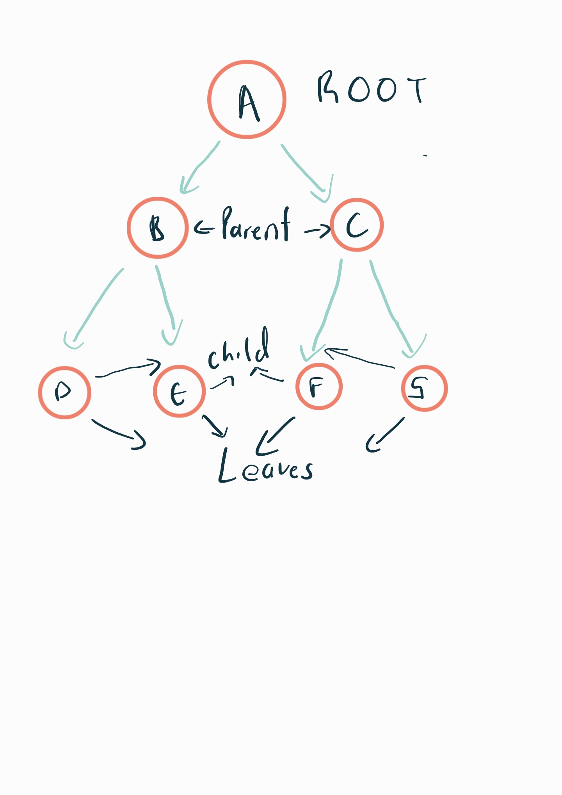
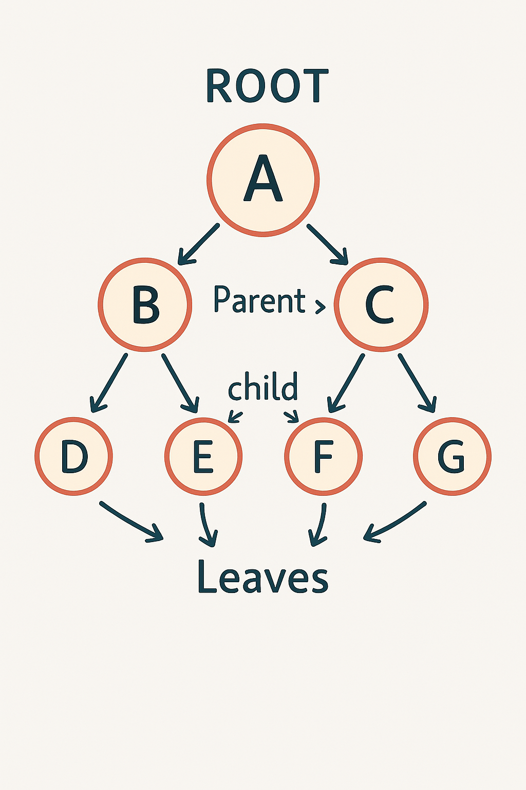

# Introduction to Trees

Trees are a data structure used to store and represent information in a hierarchical manner. Imagine an upside-down tree—we won’t worry about the roots. Instead, we’ll focus on what’s above ground.

At the top, the structure starts with a single unit, known as the trunk. From there, it splits into two or more branches, and those branches continue splitting until they reach the leaves. Each split represents a relationship between elements, with the trunk being the starting point (or root node, conceptually), the branches representing intermediate connections (nodes), and the leaves being the final elements (or child nodes).

However, in C#, and most computer science visualizations, trees are typically drawn with the root (trunk) at the top and the leaves at the bottom. This flipped representation makes it easier to visualize relationships, traversal patterns, and hierarchical dependencies within a program.

Remember, in this visual, we are not concerned with the actual roots of a tree; we are simply using this analogy to understand how tree structures function in programming.



##### Image explanation

The image above shows an example of a tree. The circled letters represent nodes, with **A** being the root node. **B** and **C** are parent nodes to **D, E, F,** and **G**, which makes **D, E, F,** and **G** their children. A node is considered a child if it is connected to a node above it.

Additionally, **D, E, F,** and **G** are also leaves because they have no further connections beneath them. What is shown above is a Binary tree.

Depending on the type of data you are working with, you might use a **binary search tree (BST)**. A BST is useful when you need to maintain an ordered structure for efficient searching, inserting, and deleting data. In a BST, each node follows a rule:

- The left child contains a value smaller than its parent node.

- The right child contains a value greater than its parent node.

For example, if the root node is **30**, the left child could be **10**, and the right child **40**. When inserting a new value, the algorithm compares it to the existing node values and places it in the correct position—either to the left or right—based on the BST rules.

---

## ## **Common Operations**

### **Insertion**

**`Node.Insert(value)`**  
When inserting a new value, the algorithm compares it to existing node values and places it in the correct position—left if it’s smaller, right if it’s larger. This maintains the binary search tree structure.

**Time Complexity:** **O(log n)** (on a balanced tree)

### **Deletion**

**`remove(value)`**  
To delete a node, there are three cases to handle:

1. If the node has no children, it is simply removed.

2. If the node has one child, it is replaced by that child.

3. If the node has two children, it is replaced by the smallest value in its right subtree (or largest in the left subtree).

**Time Complexity:** **O(log n)** (on a balanced tree)

### **Searching for a Value**

**`contains(value)`**  
This checks if a specific value exists in the tree by comparing it with the nodes as it traverses downwards, following the BST rules.

**Time Complexity:** **O(log n)** (on a balanced tree)

### **Traversing the Tree**

- **`traverse_forward`** – Visits nodes in ascending order (left-root-right).

- **`traverse_reverse`** – Visits nodes in descending order (right-root-left).

**Time Complexity:** **O(n)** (visits each node once)

### **Tree Properties**

- **`height(node)`** – Returns the height of the subtree rooted at a given node (maximum depth).

- **`size()`** – Returns the total number of nodes in the tree.

- **`empty()`** – Checks if the tree is empty.

---

## Example Problem 

#### Problem Statement

Given a Binary Search Tree (BST), write a function to find the smallest and largest values in the tree.

This is what the tree looks like.



```csharp
class TreeNode {
    public int Value { get; }
    public TreeNode? Left { get; set; }
    public TreeNode? Right { get; set; }

    public TreeNode(int value) {
        Value = value;
        Left = null;
        Right = null;
    }
}

class BST {
    public TreeNode? Root { get; private set; }

    public BST() {
        Root = null;
    }

    // Helper method to insert values into the BST
    public void Insert(int value) {
        Root = InsertRec(Root, value);
    }

    private TreeNode InsertRec(TreeNode? node, int value) {
        if (node == null) {
            return new TreeNode(value);
        }

        if (value < node.Value) {
            node.Left = InsertRec(node.Left, value);
        }
        else if (value > node.Value) {
            node.Right = InsertRec(node.Right, value);
        }

        return node;
    }

    // Finds the smallest value (leftmost node)
    public int FindSmallest() {
        if (Root == null) {
            throw new InvalidOperationException("Tree is empty.");
        }

        TreeNode current = Root;
        while (current.Left != null) {
            current = current.Left;
        }
        return current.Value;
    }

    // Finds the largest value (rightmost node)
    public int FindLargest() {
        if (Root == null) {
            throw new InvalidOperationException("Tree is empty.");
        }

        TreeNode current = Root;
        while (current.Right != null) {
            current = current.Right;
        }
        return current.Value;
    }

    // Returns a tuple (smallest, largest)
    public (int smallest, int largest) GetMinMax() {
        return (FindSmallest(), FindLargest());
    }
}

class Program {
    static void Main() {
        BST tree = new BST();
        tree.Insert(40);
        tree.Insert(5);
        tree.Insert(50);
        tree.Insert(2);
        tree.Insert(10);
        tree.Insert(60);

        var (smallest, largest) = tree.GetMinMax();
        Console.WriteLine($"Smallest value: {smallest}");  // Output: 2
        Console.WriteLine($"Largest value: {largest}");    // Output: 60
    }
}
```

explain here

```csharp
public BST() {
        Root = null;
    }
```

This is the constructor for the `BST` class. It initializes the tree with an empty root, meaning the tree starts off with no nodes.

```csharp
public void Insert(int value) {
        Root = InsertRec(Root, value);
    }
```

This method inserts a new value into the BST by calling a recursive helper method. It starts at the root and finds the correct location in the tree to insert the value while maintaining BST rules.

```csharp
    private TreeNode InsertRec(TreeNode? node, int value) {
        if (node == null) {
            return new TreeNode(value);
        }

        if (value < node.Value) {
            node.Left = InsertRec(node.Left, value);
        }
        else if (value > node.Value) {
            node.Right = InsertRec(node.Right, value);
        }

        return node;
    }
```

This recursive method does the actual insertion. If the current node is `null`, it creates a new `TreeNode`. Otherwise, it compares the value to insert with the current node's value and recursively inserts into the left or right subtree accordingly.

```csharp
    public int FindSmallest() {
        if (Root == null) {
            throw new InvalidOperationException("Tree is empty.");
        }

        TreeNode current = Root;
        while (current.Left != null) {
            current = current.Left;
        }
        return current.Value;
    }
```

This method finds the smallest value in the tree by traversing left until it reaches the leftmost node, which holds the smallest value in a BST.

```csharp
public int FindLargest() {
        if (Root == null) {
            throw new InvalidOperationException("Tree is empty.");
        }

        TreeNode current = Root;
        while (current.Right != null) {
            current = current.Right;
        }
        return current.Value;
    }
```

This method finds the largest value by moving right until it reaches the rightmost node, which is the maximum value in the BST.

```csharp
    public (int smallest, int largest) GetMinMax() {
        return (FindSmallest(), FindLargest());
    }
```

This method combines both FindSmallest and FindLargest methods and returns a tuple containing both values.

```csharp
class Program {
    static void Main() {
        BST tree = new BST();
        tree.Insert(40);
        tree.Insert(5);
        tree.Insert(50);
        tree.Insert(2);
        tree.Insert(10);
        tree.Insert(60);

        var (smallest, largest) = tree.GetMinMax();
        Console.WriteLine($"Smallest value: {smallest}");  // Output: 2
        Console.WriteLine($"Largest value: {largest}");    // Output: 60
    }
}
```

This program demonstrates how to use the BST class. It inserts several values into the tree, finds the smallest and largest values, and prints them to the console.

## Problem to solve

Write a method that checks whether a specific value exists in a Binary Search Tree (BST after it has inserted values into a tree).

```csharp
using System;

class TreeNode {
    public int Value { get; }
    public TreeNode? Left { get; set; }
    public TreeNode? Right { get; set; }

    public TreeNode(int value) {
        Value = value;
        Left = null;
        Right = null;
    }
}

class BST {
    public TreeNode? Root { get; private set; }

    public BST() {
        Root = null;
    }

    public void Insert(int value) {
        Root = InsertRec(Root, value);
    }

    private TreeNode InsertRec(TreeNode? node, int value) {
       // add your code here
        return node;
    }

    public bool Contains(int value) {
        return ContainsRec(Root, value);
    }

    private bool ContainsRec(TreeNode? node, int value) {
      // add your code here
        }
    }
}

class Program {
    static void Main() {
        BST tree = new BST();
        int[] values = { 40, 20, 60, 10, 30, 50, 70 };

        foreach (int val in values) {
            tree.Insert(val);
        }

        Console.WriteLine(tree.Contains(30));  // Output: True
        Console.WriteLine(tree.Contains(25));  // Output: False
        Console.WriteLine(tree.Contains(70));  // Output: True
    }
} 
```

Once you have attempted the above problem you can find the solution by [clicking here](Tree)

To return to the outline [click here](outline.md)
